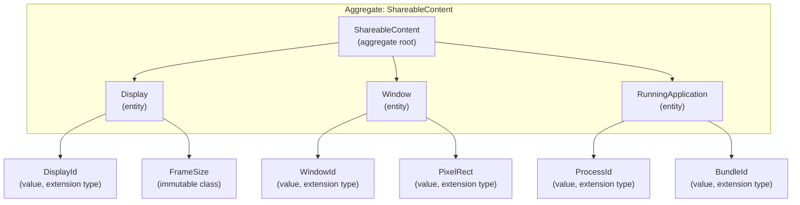
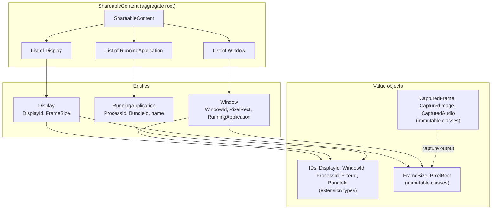

# Domain Model: Screen Capture

This document defines the **aggregate root**, **entities**, and **value objects** for the Screen Capture bounded context. **Scalar identifiers** use **Dart extension types**; **geometry, capture results, and multi-field config** use **immutable classes** (Dart 3+).

## Bounded context

**Screen Capture**: Content that can be captured (displays, windows, applications) and the results of capture (frames, images, audio). Boundaries: we do not model encoding, file formats, or external services; only capture targets and capture outputs.

---

## Aggregate: ShareableContent (aggregate root)

**Aggregate root**: `ShareableContent`

**Consistency boundary**: The aggregate is loaded in one shot from the native API (`SCShareableContent`). All references to displays, applications, and windows are contained within this root. No external entity holds a reference that must be kept consistent with ShareableContent; the root is the only entry point for reading content.

**Invariants**:

- `displays`, `applications`, and `windows` are non-null lists (may be empty).
- Each `Window` references an `RunningApplication` that is part of `applications`.
- No duplicate identities within each list (by `DisplayId`, `WindowId`, `ProcessId` as per entities below).

**Lifecycle**: Created when the application calls “get shareable content”. Immutable snapshot in Dart; native side may change after the snapshot.



---

## Entities (identity, part of aggregate)

Entities have **identity** (stable id over time). They are immutable snapshots in Dart.

| Entity | Identity | Description |
|--------|----------|-------------|
| **Display** | `DisplayId` | A display device. Contains `DisplayId`, `FrameSize` (width × height). |
| **Window** | `WindowId` | An on-screen window. Contains `WindowId`, `PixelRect` (frame), `RunningApplication` (owner), optional title. |
| **RunningApplication** | `ProcessId` (+ `BundleId` / name for display) | A running app. Contains `ProcessId`, `BundleId`, application name. |

Entities reference **value objects**: extension-type **identifiers** and immutable **geometry** types (`FrameSize`, `PixelRect`). They do **not** hold raw `int`/`double` for ids and dimensions where a value object exists.

---

## Value objects (IDs as extension types, others as immutable classes)

Value objects use **Dart extension types** for scalar identifiers, and **immutable classes** for multi-field structures (geometry, capture results).

### Identifier value objects (extension types)

**Integer identifiers** (extension type on `int`):

| Value object | Representation | Purpose |
|--------------|----------------|---------|
| **DisplayId** | `int` | Display identifier (maps to native). |
| **WindowId** | `int` | Window identifier (maps to native). |
| **ProcessId** | `int` | Process identifier (maps to native). |
| **FilterId** | `int` | Opaque filter handle id (must be > 0). Must be released via application service. |

**String identifiers**:

| Value object | Representation | Purpose |
|--------------|----------------|---------|
| **BundleId** | `String` | Application bundle identifier (reverse-DNS; may be empty when absent from native). |

Example:

```dart
extension type const DisplayId(int value) {}

extension type const FilterId(int value) {}
// Creation sites must enforce FilterId(id) with id > 0.
```

`FilterId` is the public API type for a content filter; it must be released with `releaseFilter` when no longer needed.

### Geometric / size value objects (immutable classes)

| Value object | Representation | Purpose |
|--------------|----------------|---------|
| **FrameSize** | `(int width, int height)` | Width and height in pixels; use the [`FrameSize`] factory — **non-negative**, and either **0×0** ([`FrameSize.zero`]) or **both strictly positive**; otherwise [`ArgumentError`]. |
| **PixelRect** | `(double x, double y, double width, double height)` | Rectangle in screen points (e.g. window frame, source rect). |

### Stream configuration value objects (immutable classes)

| Value object | Representation | Purpose |
|--------------|----------------|---------|
| **FrameRate** | `(int fps)` | Target capture frame rate in FPS (`1..120`); invalid values throw [`ArgumentError`]. |
| **QueueDepth** | `(int depth)` | Capture stream frame queue depth (`1..8`); invalid values throw [`ArgumentError`]. |

### Capture result value objects (immutable classes)

These represent a single frame, image, or audio buffer. They are **immutable** and defined by their data and metadata (no identity).

| Value object | Representation | Purpose |
|--------------|----------------|---------|
| **CapturedFrame** | `(Uint8List bgraData, FrameSize size, int bytesPerRow)` | One video frame (BGRA pixels). |
| **CapturedImage** | `(Uint8List pngData, FrameSize size)` | One screenshot (PNG bytes). |
| **CapturedAudio** | Record `(Uint8List pcmData, double sampleRate, int channelCount, String format)` | One audio buffer (PCM). |

These are modelled as immutable classes in the codebase; see the corresponding Dart files for concrete implementations.

---

## Domain model diagram (overview)



---

## Rules

1. **Value objects**: Implement scalar identifier value objects as **Dart extension types** (e.g. `DisplayId`, `WindowId`, `ProcessId`, `FilterId`, `BundleId`), and model multi-field value objects (e.g. `FrameSize`, `PixelRect`, `CapturedFrame`, `CapturedImage`, `CapturedAudio`) as immutable classes.
2. **Entities**: Use value object types for ids and dimensions (e.g. `Display` has `DisplayId` and `FrameSize`, not raw `int`).
3. **Aggregate root**: Only `ShareableContent` is the aggregate root. All reads of “what can be captured” go through it. Do not add another root for the same consistency boundary.
4. **Capture results**: `CapturedFrame`, `CapturedImage`, and `CapturedAudio` are value objects implemented as **immutable classes** (not extension types); they are produced by the application/infrastructure layer and consumed by the caller; they do not belong to the ShareableContent aggregate.
5. **FilterId**: Represents an opaque native content filter. Use `FilterId > 0` at construction; document that it must be released via the application service (`releaseFilter`).

---

## File placement (domain layer)

- `domain/entities/` — entities: `display.dart`, `window.dart`, `running_application.dart`, `shareable_content.dart` (aggregate root).
- `domain/value_objects/geometry/` — `frame_size.dart`, `pixel_rect.dart`.
- `domain/value_objects/identifiers/` — `display_id.dart`, `window_id.dart`, `process_id.dart`, `filter_id.dart`, `bundle_id.dart`.
- `domain/value_objects/capture/` — `captured_frame.dart`, `captured_image.dart`, `captured_audio.dart`, `content_filter.dart`, `content_sharing_picker_mode.dart`, `content_sharing_picker_configuration.dart`, `stream_configuration.dart`.
- `domain/errors/screen_capture_kit_exception.dart` — domain exception (no extension type).

`FilterId` is exported from the public API.
