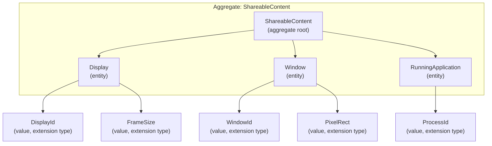
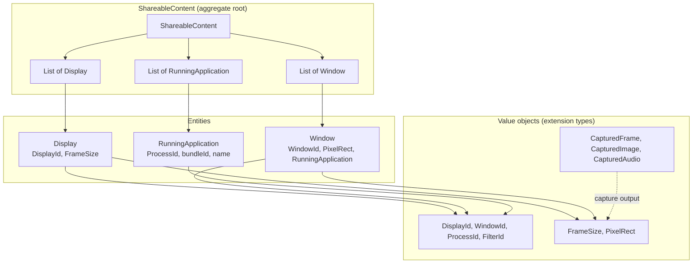

# Domain Model: Screen Capture

This document defines the **aggregate root**, **entities**, and **value objects** for the Screen Capture bounded context. Value objects are implemented using **Dart extension types** (Dart 3+).

## Bounded context

**Screen Capture**: Content that can be captured (displays, windows, applications) and the results of capture (frames, images, audio). Boundaries: we do not model encoding, file formats, or external services; only capture targets and capture outputs.

---

## Aggregate: ShareableContent (aggregate root)

**Aggregate root**: `ShareableContent`

**Consistency boundary**: The aggregate is loaded in one shot from the native API (`SCShareableContent`). All references to displays, applications, and windows are contained within this root. No external entity holds a reference that must be kept consistent with ShareableContent; the root is the only entry point for reading content.

**Invariants**:

- `displays`, `applications`, and `windows` are non-null lists (may be empty).
- Each `Window` references an `RunningApplication` that is part of `applications`.
- No duplicate identities within each list (by `DisplayId`, `WindowId`, `ProcessId` as per entities below).

**Lifecycle**: Created when the application calls “get shareable content”. Immutable snapshot in Dart; native side may change after the snapshot.



---

## Entities (identity, part of aggregate)

Entities have **identity** (stable id over time). They are immutable snapshots in Dart.

| Entity | Identity | Description |
|--------|----------|-------------|
| **Display** | `DisplayId` | A display device. Contains `DisplayId`, `FrameSize` (width × height). |
| **Window** | `WindowId` | An on-screen window. Contains `WindowId`, `PixelRect` (frame), `RunningApplication` (owner), optional title. |
| **RunningApplication** | `ProcessId` (+ app name / bundle id for display) | A running app. Contains `ProcessId`, bundle identifier, application name. |

Entities reference **value objects** (IDs, rects, sizes) implemented as extension types. They do **not** hold raw `int`/`double` for ids and dimensions; they use the value object types.

---

## Value objects (extension types)

All value objects are implemented with **Dart extension types** to get a distinct type, zero-cost wrapping, and a clear API. The representation type is either a single primitive (for IDs) or a **record** (for multi-field values).

### Identifier value objects (extension type on `int`)

| Value object | Representation | Purpose |
|--------------|----------------|---------|
| **DisplayId** | `int` | Display identifier (maps to native). |
| **WindowId** | `int` | Window identifier (maps to native). |
| **ProcessId** | `int` | Process identifier (maps to native). |
| **FilterId** | `int` | Opaque filter handle id (must be > 0). Used by `ContentFilterHandle`. |

Example:

```dart
extension type DisplayId(int value) {
  int get displayId => value;
}
extension type FilterId(int value) {
  int get filterId => value;
  /// Use at construction: FilterId(id) with id > 0.
}
```

`ContentFilterHandle` is the public API type for a filter; it can be an extension type on `FilterId` (or on `int`) and must enforce `value > 0` at construction.

### Geometric / size value objects (extension type on record)

| Value object | Representation | Purpose |
|--------------|----------------|---------|
| **FrameSize** | `(int width, int height)` | Width and height in pixels. |
| **PixelRect** | `(double x, double y, double width, double height)` | Rectangle in screen points (e.g. window frame, source rect). |

Example:

```dart
extension type FrameSize((int, int) _) {
  FrameSize(int width, int height) : _ = (width, height);
  int get width => _.$1;
  int get height => _.$2;
}
extension type PixelRect(({double x, double y, double width, double height}) _) {
  PixelRect({required double x, required double y, required double width, required double height})
      : _ = (x: x, y: y, width: width, height: height);
  double get x => _.x;
  double get y => _.y;
  double get width => _.width;
  double get height => _.height;
}
```

### Capture result value objects (extension type on record)

These represent a single frame, image, or audio buffer. They are **immutable** and defined by their data and metadata (no identity).

| Value object | Representation | Purpose |
|--------------|----------------|---------|
| **CapturedFrame** | Record `(Uint8List bgraData, int width, int height, int bytesPerRow)` | One video frame (BGRA pixels). |
| **CapturedImage** | Record `(Uint8List pngData, int width, int height)` | One screenshot (PNG bytes). |
| **CapturedAudio** | Record `(Uint8List pcmData, double sampleRate, int channelCount, String format)` | One audio buffer (PCM). |

Example (conceptually):

```dart
extension type CapturedFrame((Uint8List, int, int, int) _) {
  CapturedFrame({required Uint8List bgraData, required int width, required int height, required int bytesPerRow})
      : _ = (bgraData, width, height, bytesPerRow);
  Uint8List get bgraData => _.$1;
  int get width => _.$2;
  int get height => _.$3;
  int get bytesPerRow => _.$4;
}
```

Use positional record `(int, int)` or named record `({double x, double y, ...})` as the representation type; expose getters so callers do not depend on `_.$1` etc.

---

## Domain model diagram (overview)



---

## Rules

1. **Value objects**: Implement all value objects as **Dart extension types**. Use `int` for single-id types; use a **record** for multi-field value objects and expose getters on the extension type.
2. **Entities**: Use value object types for ids and dimensions (e.g. `Display` has `DisplayId` and `FrameSize`, not raw `int`).
3. **Aggregate root**: Only `ShareableContent` is the aggregate root. All reads of “what can be captured” go through it. Do not add another root for the same consistency boundary.
4. **Capture results**: `CapturedFrame`, `CapturedImage`, and `CapturedAudio` are value objects (extension types); they are produced by the application/infrastructure layer and consumed by the caller; they do not belong to the ShareableContent aggregate.
5. **ContentFilterHandle**: Represents an opaque native filter. Model as a value object (extension type on `FilterId` or `int`) in the API layer; ensure `FilterId > 0` at construction and document that the handle must be released via the application service.

---

## File placement (domain layer)

- `domain/shareable_content.dart` — aggregate root.
- `domain/display.dart` — entity `Display` (uses `DisplayId`, `FrameSize`).
- `domain/window.dart` — entity `Window` (uses `WindowId`, `PixelRect`, references `RunningApplication`).
- `domain/running_application.dart` — entity `RunningApplication` (uses `ProcessId`).
- `domain/value_objects/` — extension types: `display_id.dart`, `window_id.dart`, `process_id.dart`, `filter_id.dart`, `frame_size.dart`, `pixel_rect.dart`, `captured_frame.dart`, `captured_image.dart`, `captured_audio.dart`.
- `domain/screen_capture_kit_exception.dart` — domain exception (no extension type).

Presentation/API may re-export `ContentFilterHandle` as an extension type on `FilterId` for the public API.
